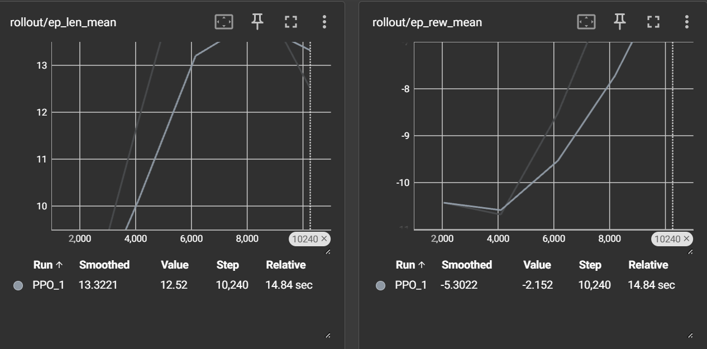
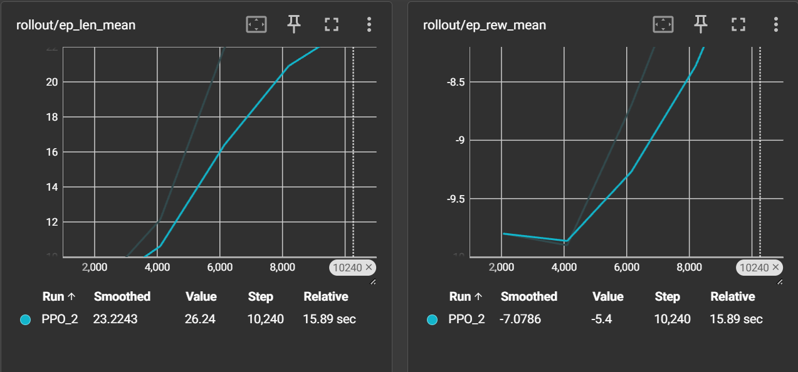
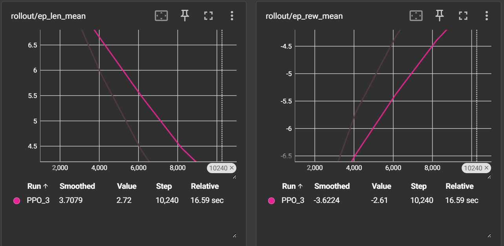

# Lab 13 Reinforcement Learning Lab Report

## Custom Reward Function 1
My first function gives a reward of 10 for making it to the goal, a -10 for going into a hole, and a -0.1 anywhere else to try to get it there faster.

The reward function did not work out that well. It took the agent some time to be able to complete this. The len graph did start to go down towards the end.

## Custom Reward Function 2
My second reward function does not give a positive reward, it only gives -10 if it goes into a hole.

This reward function did not do any better than the first. This is mostly due to the fact that it never got a positive reward.

## Custom Reward Function 3
My third function gives a reward of 10 when it makes it to the goal, and -1 any other time

This was the fastest for the agent reaching the goal. The two graphs have the biggest slope compared to the others.